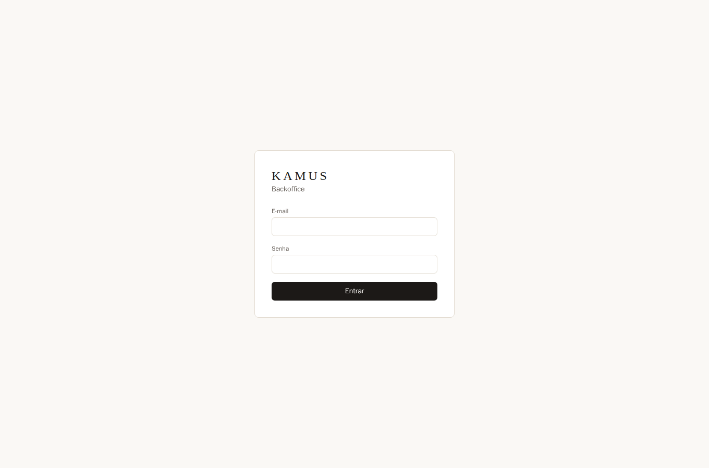
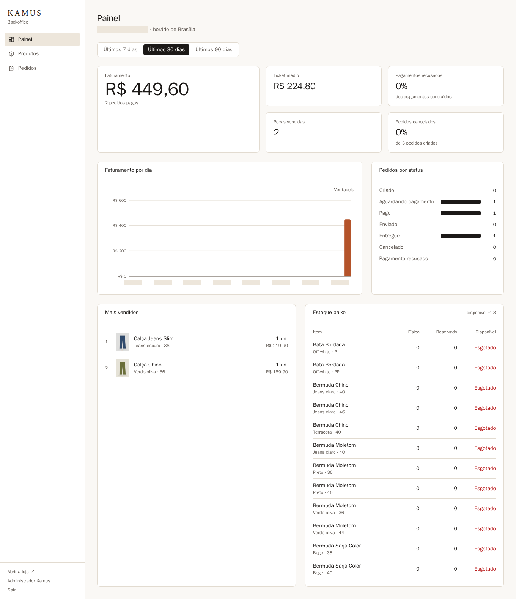
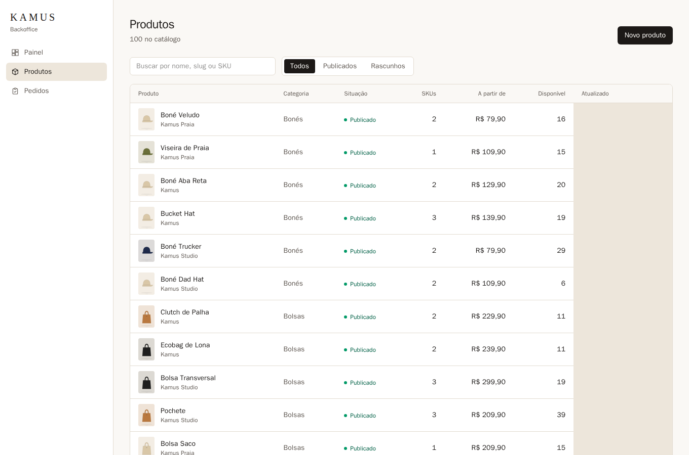
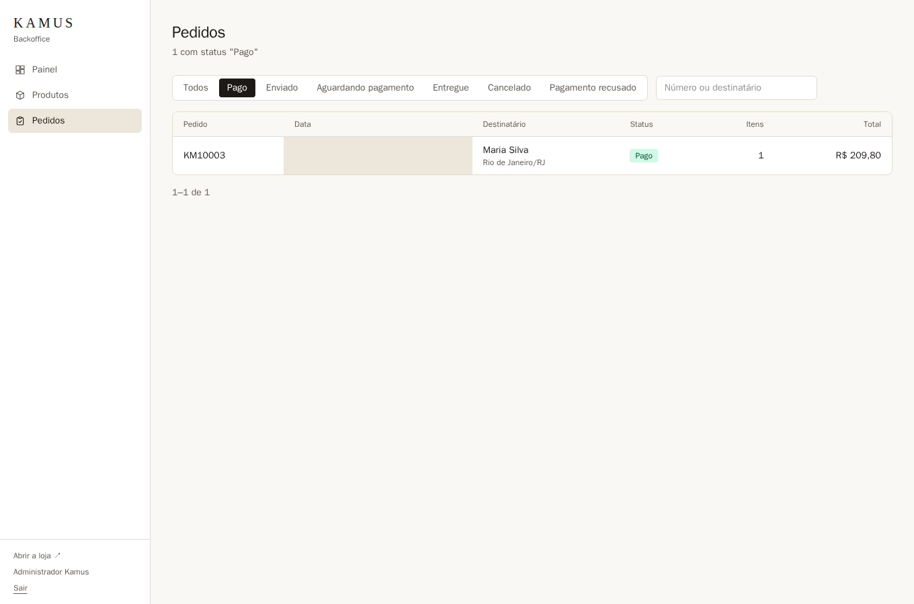
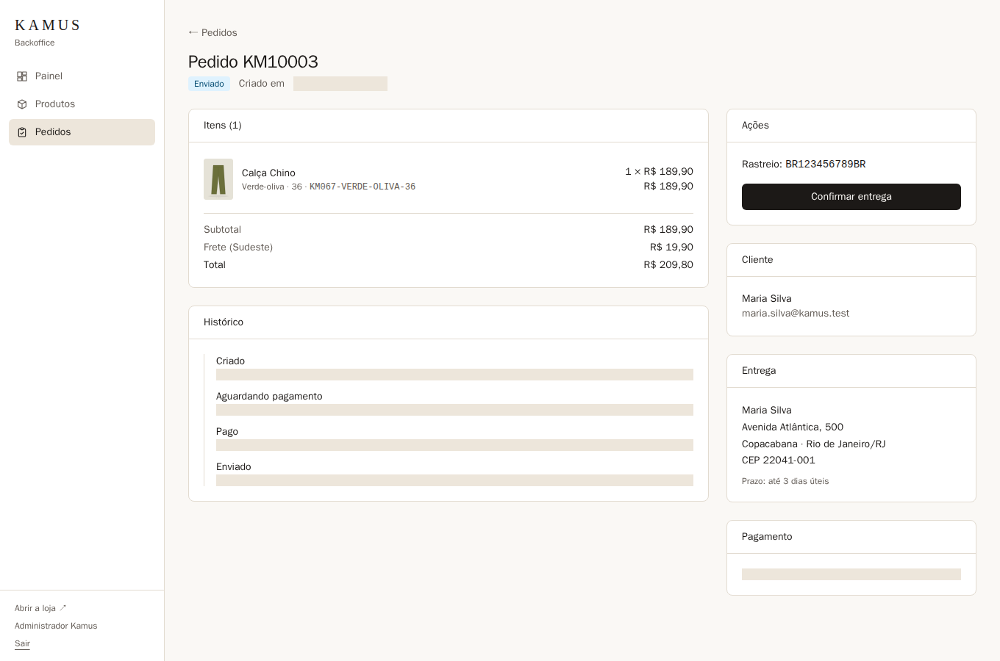

# Design · Backoffice

Capturas do backoffice (`apps/admin`) geradas pelos testes E2E, com os pedidos criados no fluxo
de compra. Os tokens são os mesmos da loja ([`packages/tokens/theme.css`](../../../packages/tokens/theme.css)).

**Estilo:** denso e utilitário; sans-serif, tabelas, formulários compactos e indicadores. Gráficos
usam uma única série na cor de destaque (terracota); as cores de status ficam reservadas aos selos.

## Telas

|                                             |                                                      |
| ------------------------------------------- | ---------------------------------------------------- |
|                 |         |
|  |     |
|             |  |

## Convenções

- `telas/`: páginas, numeradas na ordem de navegação. Componentes isolados, quando houver, vão em
  `componentes/`.
- Nomes em português, minúsculos, com hífen.
- Capturas em 1x, desktop (1360px de largura).

## Como estas imagens são geradas

Elas são as **capturas de referência dos testes E2E** (`e2e/`, ADR 0013), produzidas numa stack
isolada com banco zerado, sempre iguais:

```bash
./e2e/run.sh            # compara as telas atuais com estas imagens (o CI faz o mesmo)
./e2e/run.sh --update   # aceita mudanças intencionais e reescreve as imagens
```

Áreas em tom areia cobrem valores que mudam a cada execução (datas, horas, ids).
