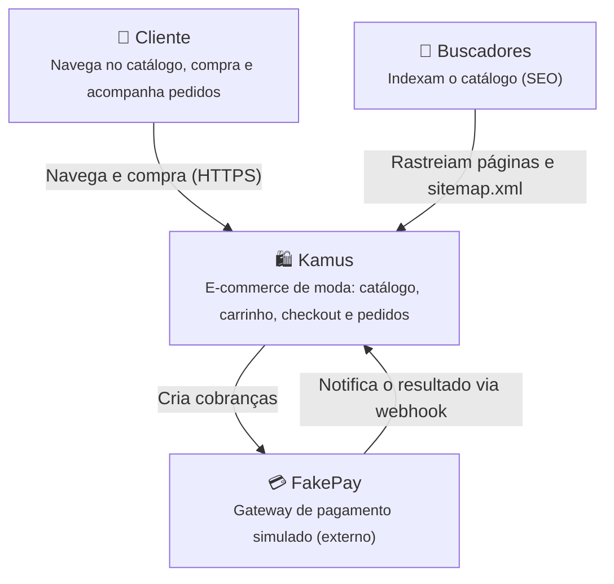
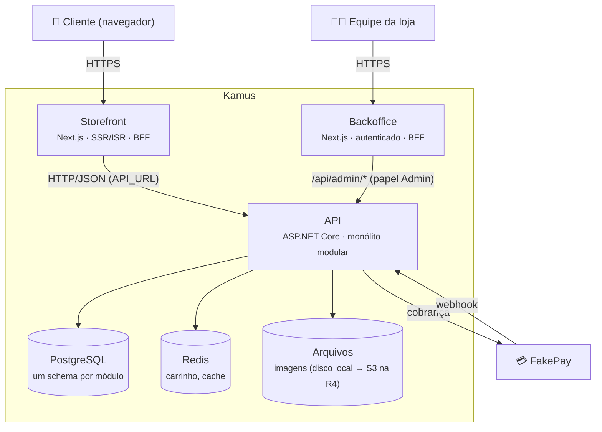
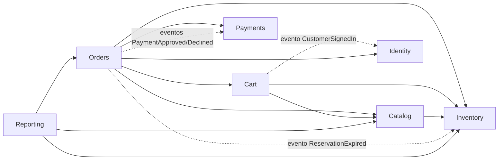
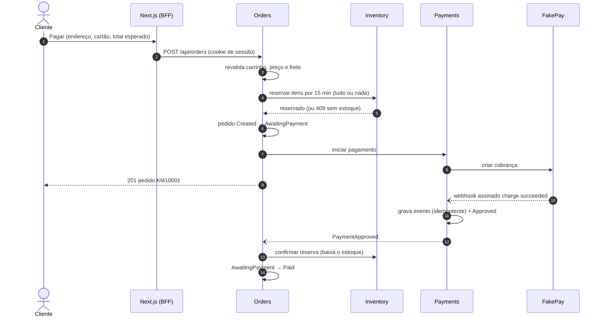
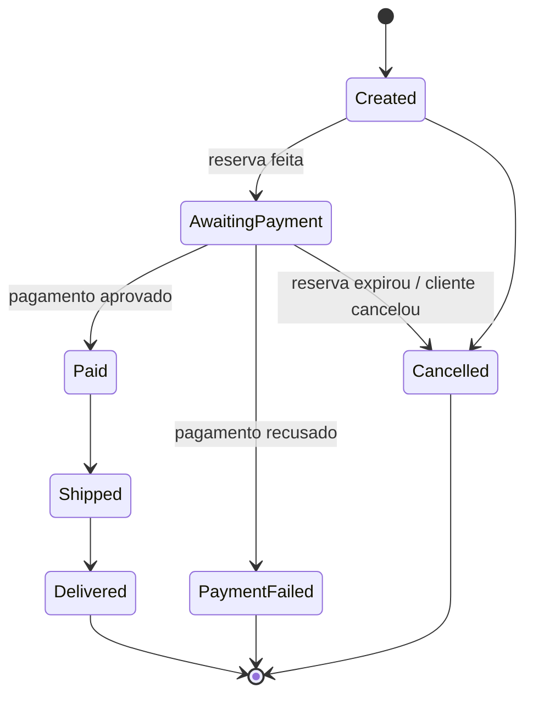

# Arquitetura

Visão da arquitetura do Kamus usando o [modelo C4](https://c4model.com/). Os diagramas usam Mermaid e
são renderizados pelo GitHub.

## Nível 1 — Contexto

Quem usa o sistema e com quais sistemas externos ele conversa.

## Nível 2 — Contêineres

## Módulos da API

| Módulo | Responsabilidade | Armazenamento |
|---|---|---|
| Catalog | Produtos, SKUs, categorias, coleções, imagens | `catalog` (Postgres) |
| Inventory | Níveis de estoque e reservas | `inventory` (Postgres) |
| Cart | Carrinho de visitantes e clientes | Redis |
| Orders | Checkout, pedidos e máquina de estados | `orders` (Postgres) |
| Payments | Integração com o FakePay e webhooks | `payments` (Postgres) |
| Identity | Clientes, papéis (Admin) e autenticação | `identity` (Postgres) |
| Reporting | Relatórios do backoffice, compostos via contratos | sem tabelas (read models na R3) |

Dependências entre módulos (sempre via `*.Contracts`):

Setas cheias são chamadas a contratos; tracejadas são eventos in-process que o módulo da esquerda
consome (publicados pelo módulo da direita).

Regras (ver [ADR 0001](adr/0001-monolito-modular.md)):

- um módulo expõe apenas `Kamus.<Modulo>.Contracts`;
- nenhum módulo acessa as tabelas de outro;
- a comunicação é in-process via contratos no MVP e passa a ser por eventos na R3.

## Fluxo de compra (R2)

Saídas alternativas: `charge.failed` → reserva liberada e pedido `PaymentFailed`; sem resposta em
15 minutos → reserva expirada e pedido `Cancelled`. Decisões em
[ADR 0007](adr/0007-carrinho-em-redis.md), [0008](adr/0008-reserva-de-estoque-e-concorrencia.md),
[0009](adr/0009-idempotencia-de-webhooks.md) e [0010](adr/0010-autenticacao-com-cookie.md).

## Máquina de estados do pedido

