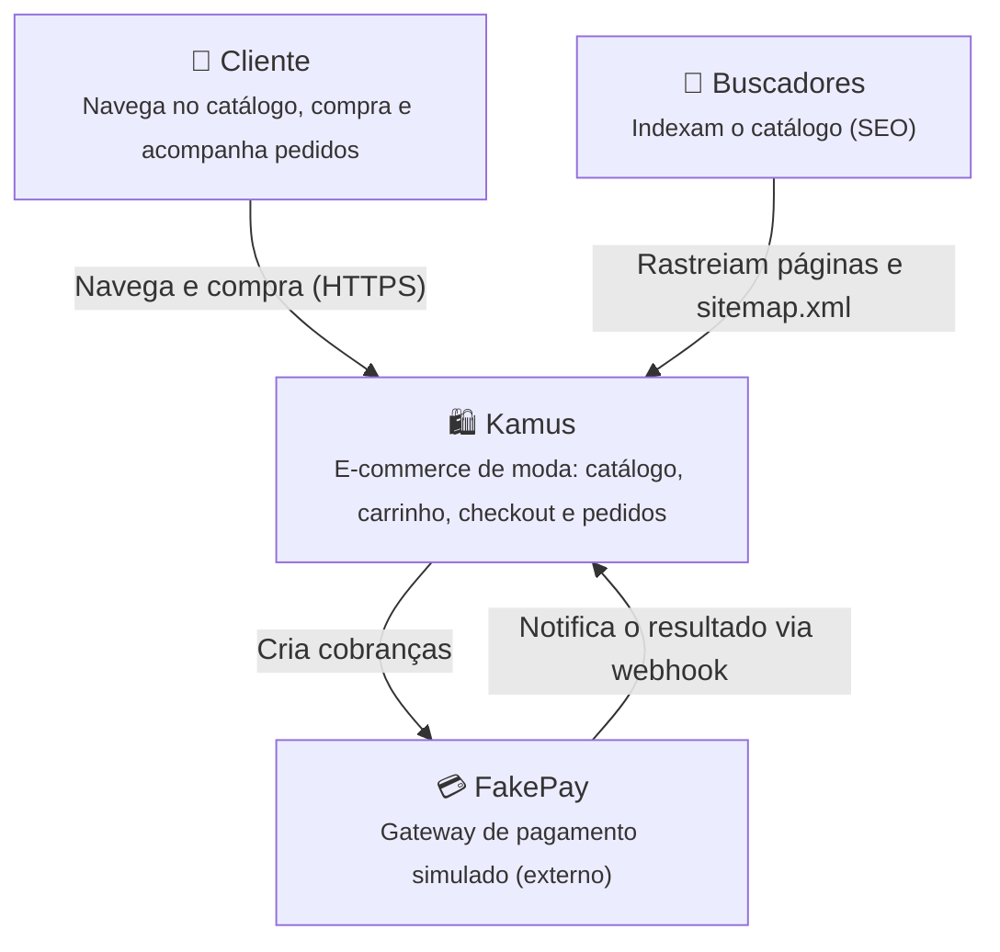
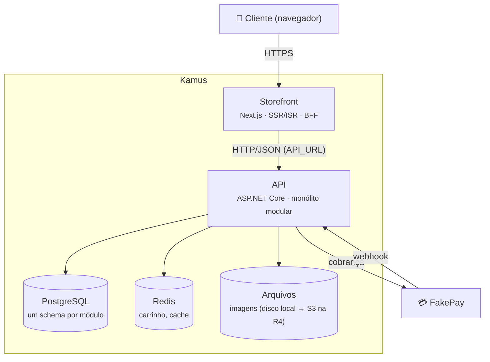

# Arquitetura

Visão da arquitetura do Kamus usando o [modelo C4](https://c4model.com/). Os diagramas usam Mermaid e
são renderizados pelo GitHub.

## Nível 1 — Contexto

Quem usa o sistema e com quais sistemas externos ele conversa.

## Nível 2 — Contêineres

## Módulos da API

| Módulo | Responsabilidade | Armazenamento |
|---|---|---|
| Catalog | Produtos, SKUs, categorias, coleções, imagens | `catalog` (Postgres) |
| Inventory | Níveis de estoque e reservas | `inventory` (Postgres) |
| Cart | Carrinho de visitantes e clientes | Redis |
| Orders | Checkout, pedidos e máquina de estados | `orders` (Postgres) |
| Payments | Integração com o FakePay e webhooks | `payments` (Postgres) |
| Identity | Clientes e autenticação | `identity` (Postgres) |

Regras (ver [ADR 0001](adr/0001-monolito-modular.md)):

- um módulo expõe apenas `Kamus.<Modulo>.Contracts`;
- nenhum módulo acessa as tabelas de outro;
- a comunicação é in-process via contratos no MVP e passa a ser por eventos na R3.
