# Design system

O Kamus tem duas "peles" sobre os mesmos tokens de cor e tipografia:

- **Loja** (`apps/web`): espaçosa, editorial, serifa nos títulos, foco em imagem e conversão.
- **Backoffice** (`apps/admin`): densa, sans-serif, tabelas, formulários compactos, gráficos e
  indicadores. Status de pedido usam as mesmas cores nas duas, e nos gráficos a cor de destaque
  (terracota) é a única série; cores de status nunca viram cor de série.

Os tokens estão em `apps/web/src/app/globals.css` e `apps/admin/src/app/globals.css` (ADR 0011).

## Loja

| | |
|---|---|
| 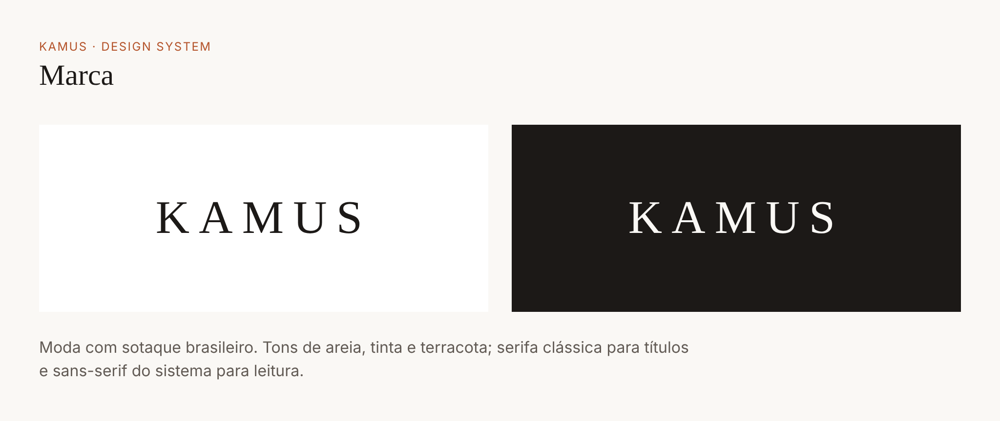 | 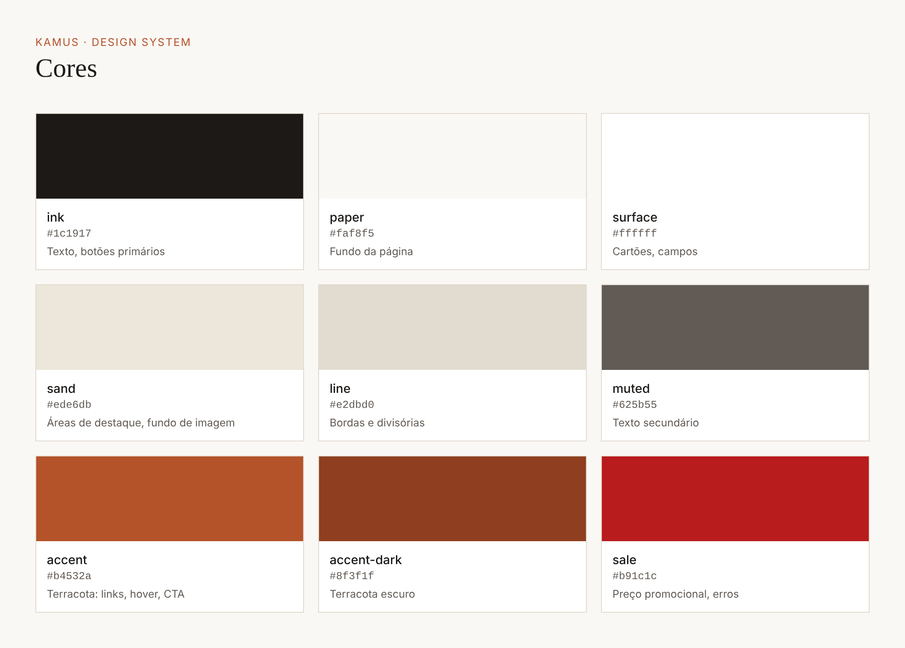 |
| 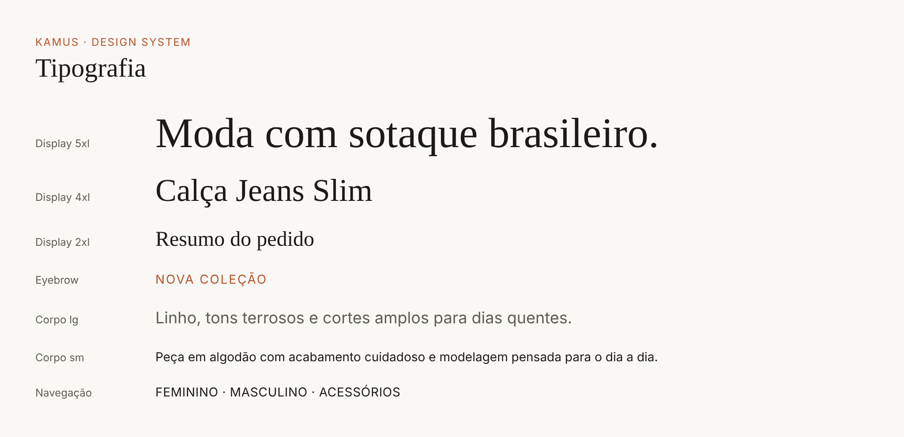 | 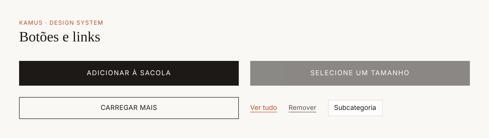 |
|  | 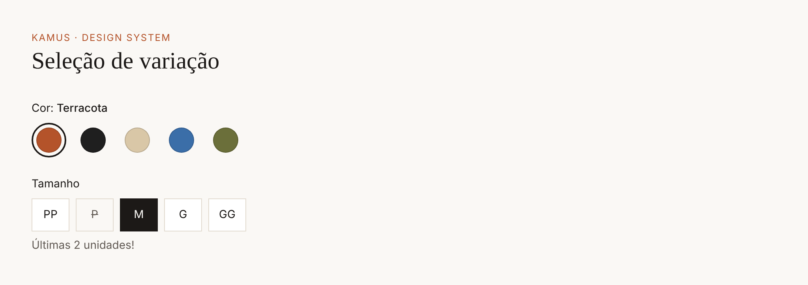 |
| 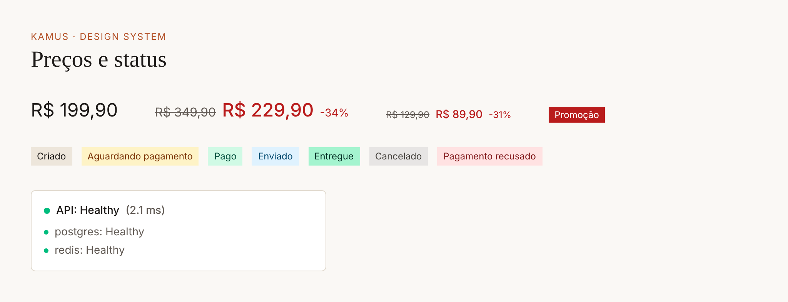 | 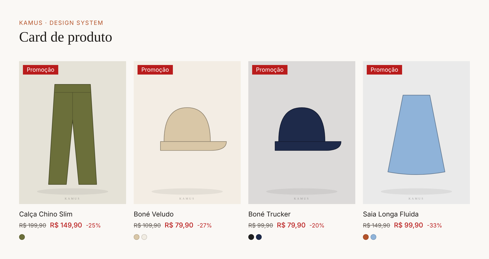 |
| 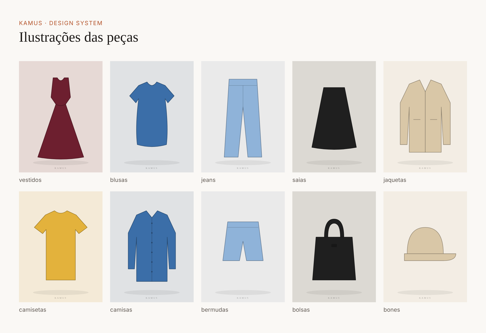 | |

## Telas

| Desktop | Mobile |
|---|---|
| 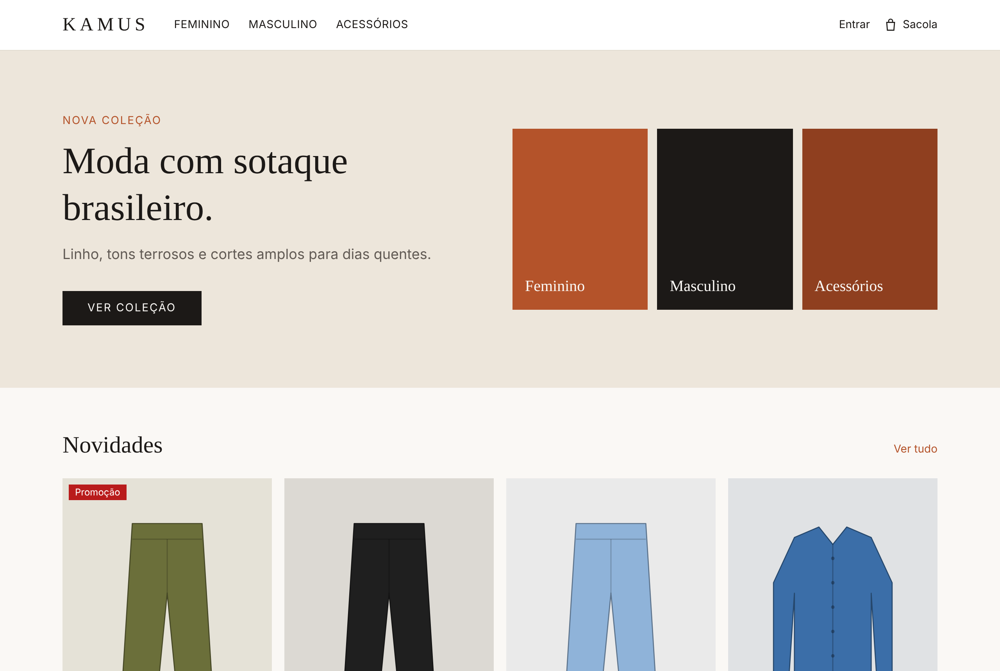 | 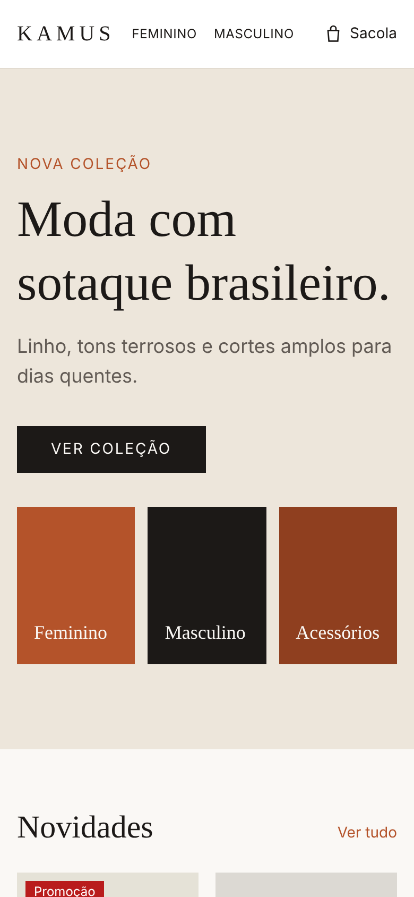 |
| 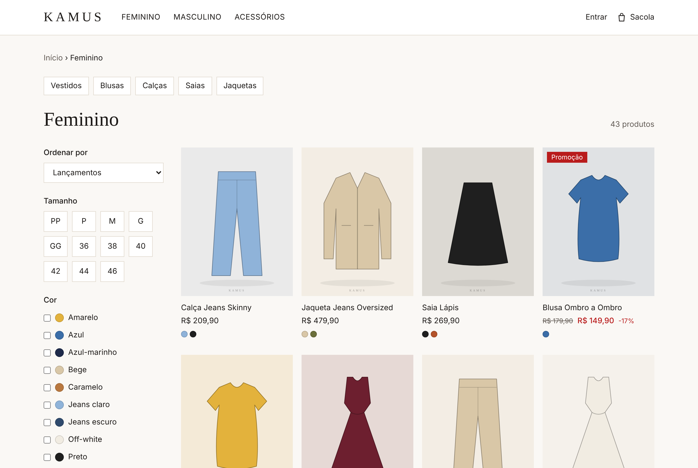 | 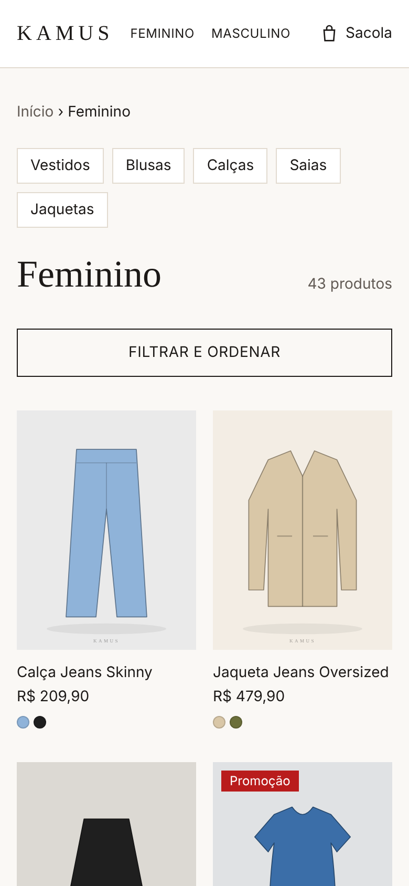 |
|  | 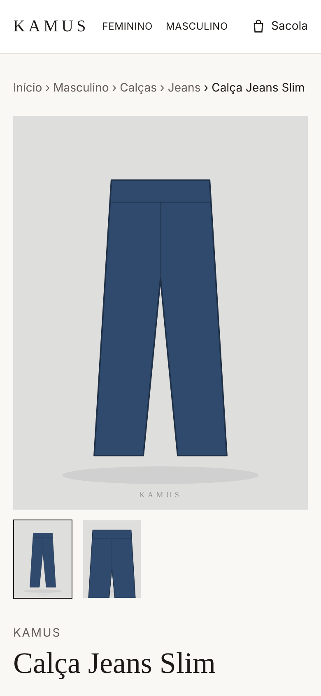 |

## Backoffice

| | |
|---|---|
|  | 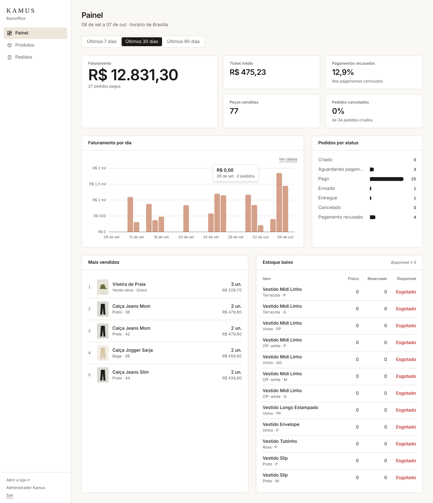 |
| 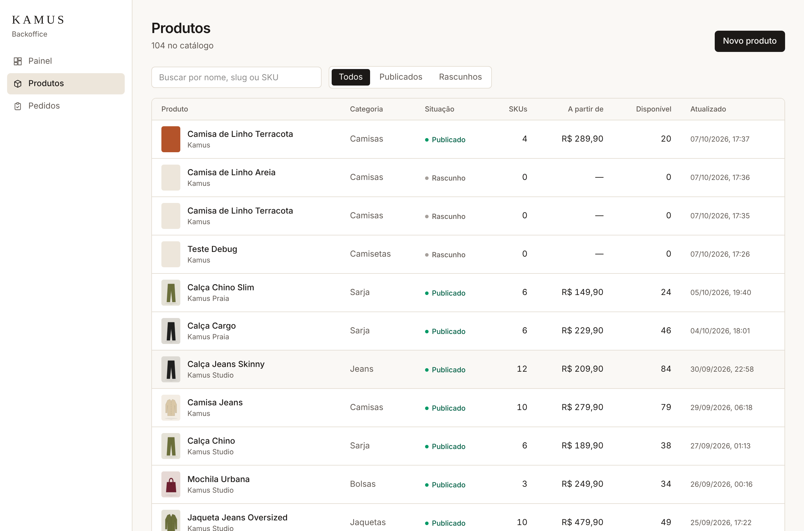 | 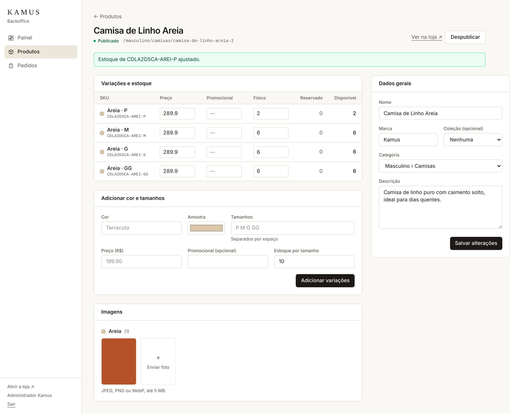 |
| 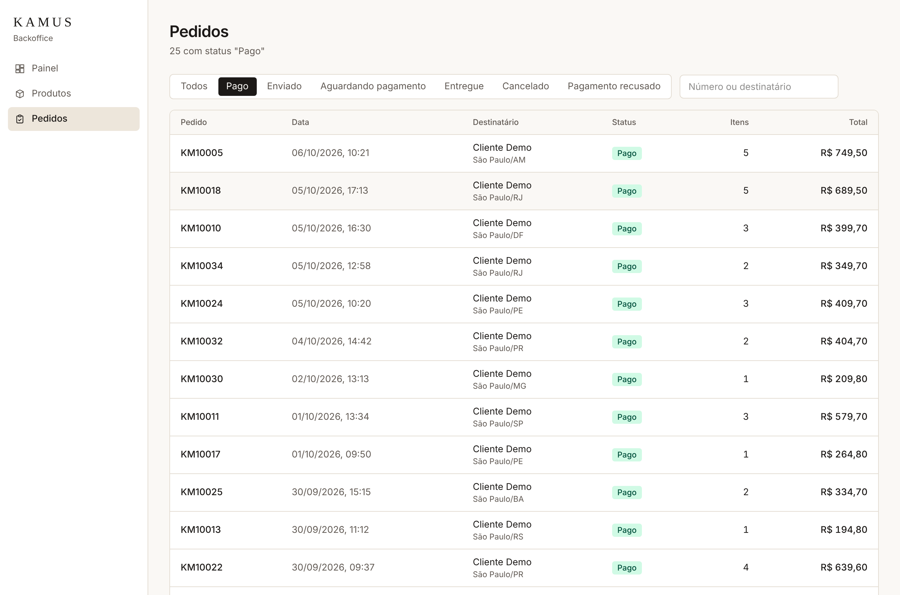 | 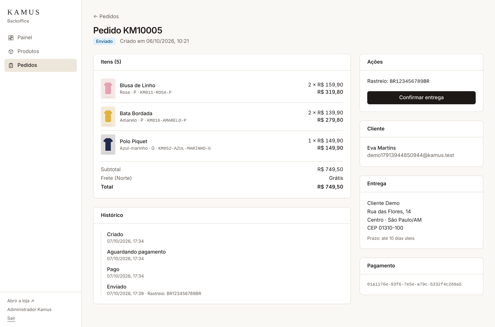 |
